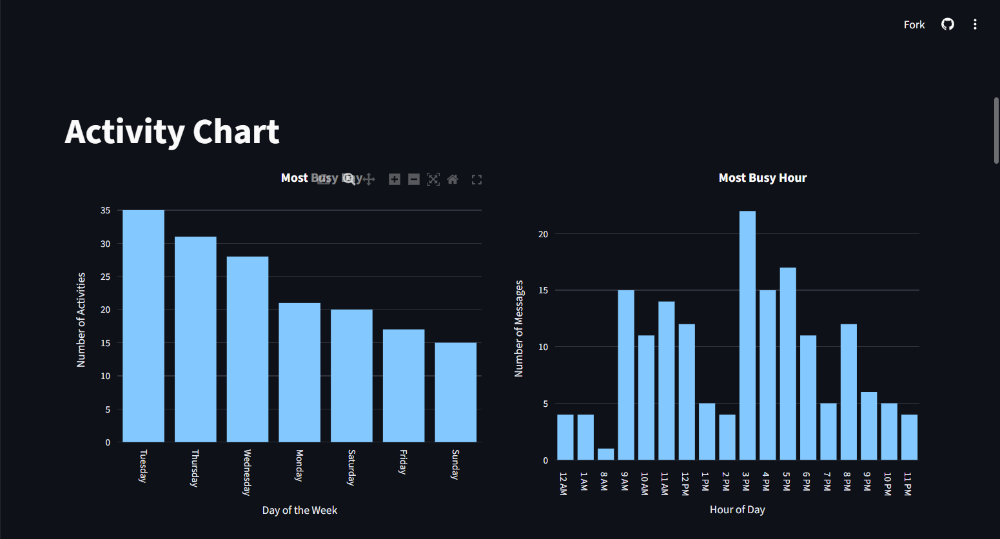
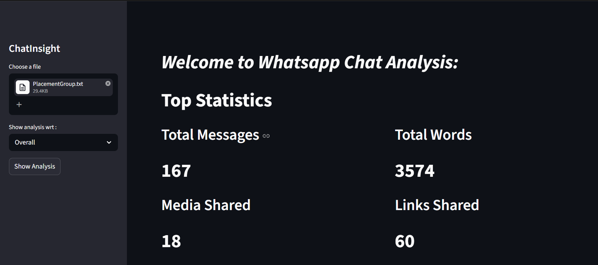

## ChatInsight -> Turn your chats into meaningful insights.

## Overview
ChatInsight is a web app that analyzes WhatsApp chats and shows useful insights like activity, words, emojis, and sentiment.

## Features
- Chat statistics (messages, words, media, links)
- Monthly timeline
- Activity map (day & hour)
- Most active users
- Word cloud
- Most common words
- Emoji analysis
- Sentiment analysis

## Tech Stack
- Python
- Streamlit
- Pandas
- Plotly
- Matplotlib
- WordCloud
- TextBlob

## Live App
https://chatinsight-app.streamlit.app/

## How to Run

Install dependencies:
pip install -r requirements.txt

Run the app:
streamlit run app.py

## Screenshots

## Author
Sahil Anand

